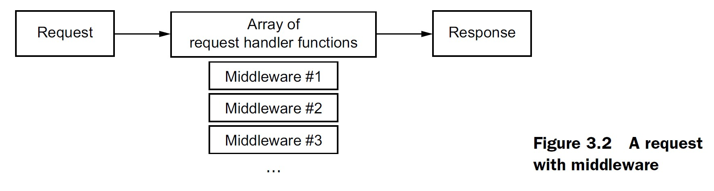

# Express 基础

Express 提供了 4 个主要特性：

- 中间件
- 路由
- 对 request 与 response 对象的扩展
- 视图
  
## 中间件

中间件并不是 Express 框架中特有的，比如：Python 的 Django，PHP 的 Laravel，Ruby 的 Rack，等等。

**注意**：`app.listen(3000)` 等同于 `http.createServer(app).listen(3000)`。

